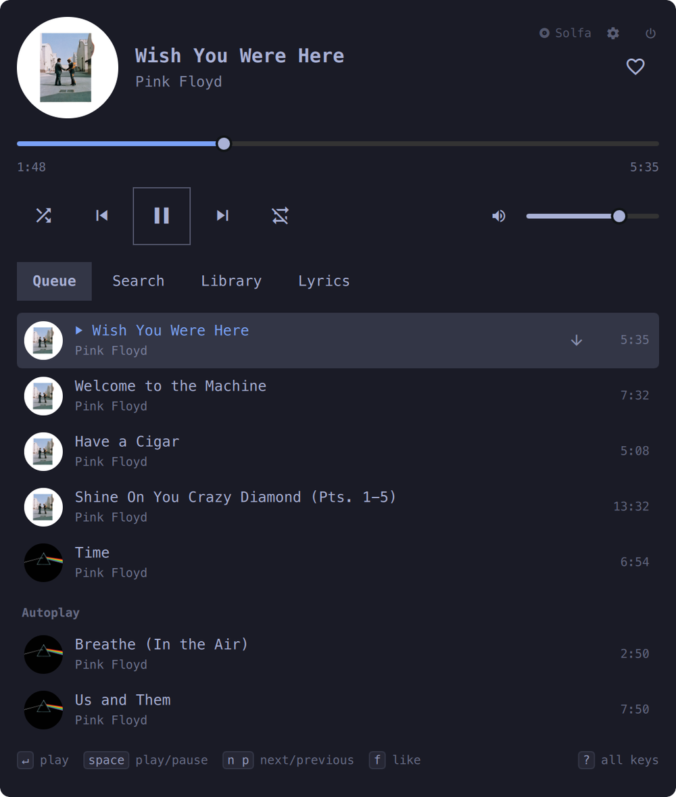
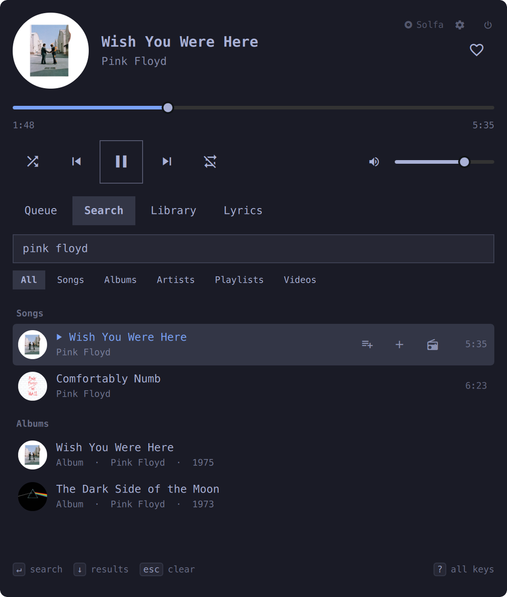

# Solfa

YouTube Music for the Omarchy shell: a bar widget with a round cover and
quick controls, and a keyboard panel for search, queue, library and lyrics.
The YouTube Music web app runs hidden as the engine. It never shows itself
and never takes focus. Sign-in happens once, in a plain Google window.





## Requirements

- Omarchy with the shell plugin system (`omarchy plugin --help` works)
- A Chromium-family browser at one of the absolute paths Solfa
  looks for (`/usr/bin/chromium`, `/usr/bin/google-chrome-stable`,
  `/usr/bin/brave`, `/usr/bin/brave-browser`, `/usr/bin/vivaldi-stable`,
  `/usr/bin/microsoft-edge-stable`, or one under the matching `/opt/...`
  install), `/usr/bin/python3`, Hyprland and a `systemd --user` session.

## Install

```bash
omarchy plugin add https://github.com/sirallap/omarchy-solfa --enable
```

Update, or remove it again:

```bash
omarchy plugin update io.github.sirallap.solfa
omarchy plugin remove io.github.sirallap.solfa
```

Removing the plugin takes down, within about 30 seconds:

- the plugin's own directory (Omarchy removes it directly);
- the bridge's `systemd --user` unit (`io.github.sirallap.solfa-bridge`);
- the engine (the hidden Chromium window playing the music);
- the Hyprland window rule that keeps the engine off-screen;
- Solfa's global key bindings;
- the runtime dir (`$XDG_RUNTIME_DIR/io.github.sirallap.solfa`) and the data dir
  (`~/.local/share/io.github.sirallap.solfa`), including the signed-in profile.

## First run

Open the panel (Super+M or a click) and choose **Sign in**.
A Google window opens: sign in there. Solfa closes it and starts YouTube
Music again, signed in (closing the window yourself works too). If YouTube
Music comes back still signed out, the panel says so, and the next **Sign in**
asks Google which account to use. Search and play work while signed out too,
with adverts.

## Keys

Global (only where the key is free; turn off with the `globalKeys` setting):
Super+M panel · Super+Alt+M play/pause · Super+Alt+N next · Super+Alt+B previous · Super+Alt+L like.
Media keys work through Chromium's own MPRIS player.

In the panel: `space` play/pause, `n`/`p` next/previous, `,`/`.` seek 10 s,
`-`/`=` volume, `m` mute, `f` like, `d` dislike, `r` repeat, `s` shuffle,
`1`–`4` or `←`/`→` tabs, `/` search, `↵` play or open, `e` play next,
`a` add to queue, `R` radio, `g` artist, `o` album, `x` remove and `J`/`K`
move in the queue, `[`/`]` filter or section, `w` show the YouTube window,
`esc` back or close, `?` all keys. The line at the bottom of the panel shows
the few you use most (the view's main key, play, next, like); `?` there, typed
or clicked, lists every key.

Bar: left click opens the panel, middle click plays or pauses, right click
skips, the wheel sets the volume, Shift+wheel seeks.

During an advert (signed out, or without Premium) the panel offers
**Skip advert**: it presses the advert's own Skip button once YouTube allows it.

## Close Solfa

Solfa's engine (the hidden Chromium that plays the music) keeps running
until you close it. To close it, and stop the music:

- in the panel, the power button in the top-right corner, next to "Solfa";
- from a terminal, with the installed copy:

  ```bash
  ~/.config/omarchy/plugins/io.github.sirallap.solfa/bin/solfa quit
  ```

Closed, the bar shows only Solfa's mark and name, dimmed. A click on it, the
power button or Space (in the panel) starts it again. To take Solfa out of
the bar as well, turn the plugin off in Omarchy's settings, then run the
`quit` above.

The bridge itself keeps running in the background (a `systemd --user` unit,
`io.github.sirallap.solfa-bridge`) so the shell can reconnect to it after a restart
without losing the engine. If no shell ever reconnects (the plugin was
removed, or disabled for good), the bridge's own orphan lease closes the
engine and itself a short while later; if the plugin is gone from disk at
that point, it also removes Solfa's data dir (the signed-in profile
included) and its runtime dir.

## Settings

The gear next to "Solfa" (top-right, beside the power button) opens
Settings in place of the panel body: Account (name, email and picture from
your signed-in account; switch account, sign out — or just Sign in while
signed out), Sound (an equalizer —
presets or ten bands, a preamp and a loudness compressor — built lazily in
the page as WebAudio, only once a setting actually needs it), Playback
(sleep timer, including "end of song", and what happens when Solfa starts),
Bar and alerts, Keys, Advanced (memory limits, clear cache, erase the
engine's profile, reset settings) and About. `↑`/`↓` move, `←`/`→` change a
row's value, `Tab` switches between the section list and the rows, `Enter`
acts, `Esc` goes back. Every setting also shows up in Omarchy's own plugin
settings screen (`manifest.json`'s schema). Audio quality (bitrate, codec)
is not built.

While signed out, a small **Sign in** button sits left of "Solfa" in the
header (`i` does the same from the keyboard). With YouTube Music Premium a
**Premium** badge takes its place; a free account shows neither. Premium is
read from the page's own config (`ytcfg` `IS_SUBSCRIBER`), never from cookies.

## Memory

The YouTube Music page grows while it is open (its own heap, tens of MB an
hour). Past 400 MB of heap, 800 MB for the page's process (skipping songs grows
that, not the heap), or 12 hours, the bridge swaps it for a fresh
page in a new process at the next quiet moment: between two songs (the next
song waits a few seconds) or after two minutes paused. The queue, the song,
its place when paused, the volume, repeat and shuffle all come back. The
engine also starts without extensions, without a spare renderer and without
the address bar's hidden pages. `SOLFA_RECYCLE_HEAP_MB`, `SOLFA_RECYCLE_RSS_MB`,
`SOLFA_RECYCLE_HOURS` and `SOLFA_RECYCLE_IDLE` (seconds) change the limits — the
heap and hours limits are also in Settings > Advanced, applied the next time
Solfa starts.

## Command line

`bin/solfa status | play-pause | next | prev | like | volume +5 | open | close | toggle | quit | call OP [JSON] | events`

`solfa quit` closes the engine, also when the bridge is gone (for example
after Solfa was switched off from Omarchy's settings).

## Security note

The engine has no DevTools port at all: it is launched with
`--remote-debugging-pipe`, so nothing listens on loopback or anywhere else.
The bridge talks to it over a pair of pipes it holds as the engine's own
parent process (it spawns the engine itself, with `posix_spawn`), the same
way it always closes it: by `pidfd`, never by a bare pid. The shell side is
a private unix socket (0600). The bridge itself runs as a transient
`systemd --user` unit, started by `Service.qml`, so it (and the pipe) can
outlive a shell restart without the engine ever needing to be found and
re-adopted over a network port.

## How it works

See [docs/design.md](docs/design.md). In short: `bin/solfa-bridge` (Python,
standard library) runs the hidden Chromium engine with its own profile,
talks to it over the DevTools protocol on a pipe (`--remote-debugging-pipe`,
no TCP port), and serves the shell on a private unix socket. `engine/agent.js`
runs inside the page and pushes every change; `Service.qml` keeps the state;
the bar widget and panel draw it.

## Tests

```bash
tests/run-all.sh
```

Parsers and the page agent run in node against invented fixtures; the bridge
runs against a fake engine (`tests/fake_engine.py`).
